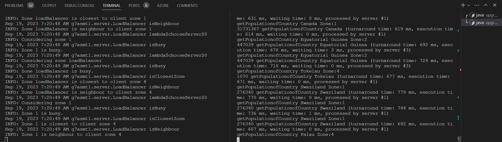

\tableofcontents
\newpage

# Introduction and design

This programming assignment follows the instructions of the assignment carefully and implements a Java RMI server, a load balancer and a client. The server is set up to run a simulation on a single machine. The NetworkSimulator class is the main class to run the server, which spins up both the LoadBalancer (which owns the registry) and 5 instances of the server (in zones named 1-5).

The client executes the instructions in the ./dataset/input.txt. The server expects to find the dataset in ./dataset/dataset.csv.

We chose to let both the Client and the Servers use the same Registry (hosted by the LoadBalancer). The LoadBalancer is responsible for distributing the work to the servers, and the servers are responsible for executing the work and returning the results to the client.

The Servers use a threadpool (with a single execution thread) that is used to execute the remote method callsin a FIFO order (guaranteed by the Java implementaiton of the ThreadPool). Calls to getQueueLength(), which is called by the LoadBalancer, are handled on the main thread and will therefore not interfere with the execution of the long-running statistics remote method calls.

# Running our implementation

1. Extract artifact.zip
2. Run `java -jar Server.jar`
3. Run `java -jar Client.jar` one or more times in separate consoles, using screen or simply `&` to run in the background.
4. Wait for the client(s) to finish
5. `Ctrl-C` to stop the server(s)

Source code is provided in source.zip and on [https://github.com/chrfrenning/upgraded-umbrella](GitHub/upgraded-umbrella)

# Screenshots while running

 \

 \

# Project and workload distribution

We used GitHub for source control and GitHub issues as a very lightweight tool for an informal Kanban style development process. We created
issues for each of the tasks in the assignment, and group members picked them up and assigned them to themselves for implementation. We met
in group meetings on the 4th floor on several occasions to discuss progress and decide on architectural decisions. We also used Discord
for async communication, sharing and making (smaller) decisions.